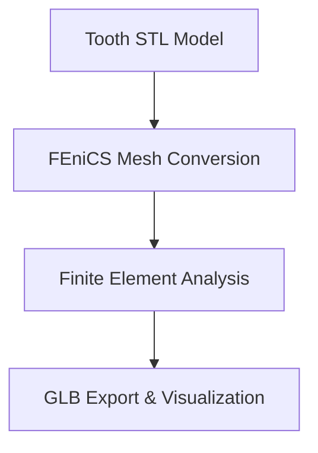

# FEA_for_Dentistry

 

## Technical Architecture & Workflow

### Architecture Diagram

```mermaid
graph TD
    A[Tooth STL Model] --> B[FEniCS Mesh Conversion]
    B --> C[Finite Element Analysis]
    C --> D[GLB Export & Visualization]
```
