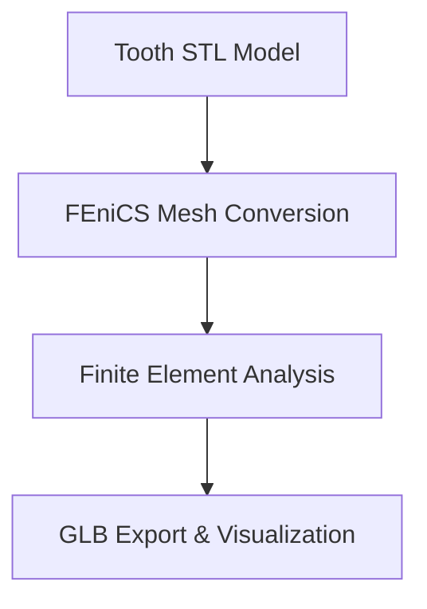

# FEA_for_Dentistry

    


 

## 개요


### Architecture Diagram


## 설치 및 실행 방법
```bash
pip install -r requirements.txt
```


## 가중치 파일 안내
본 모듈은 가중치 모델이 불필요한 룰베이스/인프라/기하학 모듈이므로, 별도의 딥러닝 가중치 파일이 요구되지 않습니다.
